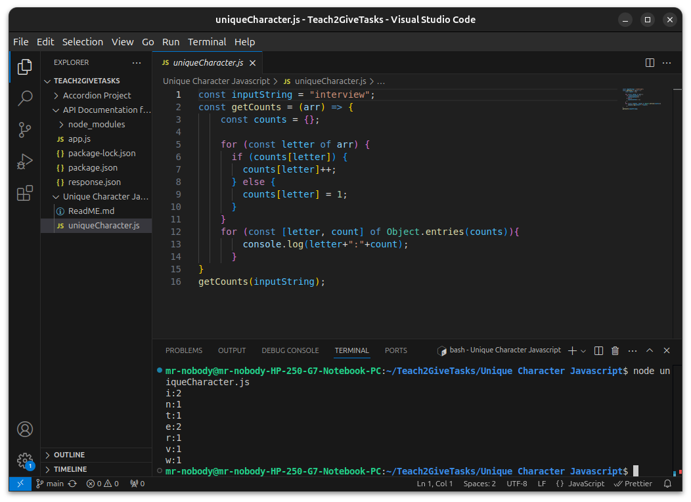

# This is the code output.

# Time Complexity
The time the program takes to count frequencies for each letter 'n' is **O(n)**.
The time the program takes to output the keys and frequencies is denoted by **O(k)** where **k** in the number of distinct letters.this is due to **Object.entries(count) taking O(k)** time iterating through the keys of the object.

**Overall time complexity** is :
**O(k+n).**

In **worst case scenario**, where all characters are distinct, the time complexity id **O(n + n)** where **n** is the input size.

# Scalability
The runtime of the program increases with increase in input size(n) provided space complexity is directly proportional.

# Optimization: 
Avoid outputs inside the function if dataset is large.
Using a map ,which is faster than an objects in frequent additions and lookups.
Avoiding unecessary iterations.
